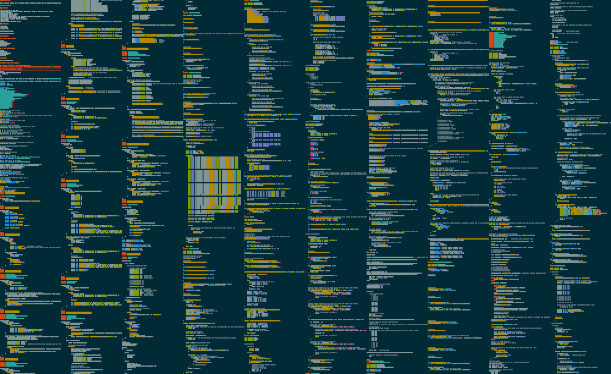

# codevis

**codevis** takes all source code / UTF-8 encodable files in a folder and renders them to one image, syntax highlighting any file it knows how to. These images show the shape and size of files, but not the exact characters inside the files. Looking for a video instead of an image? Check out this repo's sister project [codemov](https://github.com/sloganking/codemov)

This repo's render of [sloganking/My-Own-OS](https://github.com/sloganking/My-Own-OS/tree/6e555c05ce46dcc13904eb41cc4b3ccde61032b5):

## CLI Installation

- Install [the Rust programming language.](https://www.rust-lang.org/)
- Run `cargo install codevis`
- You may have to add your cargo binary installation folder to your system's path, if it is not there already.

## CLI Usage

To visualize all files in the current directory and subdirectories. Run `codevis -i ./`. This will store the visualization in a new file called `./output.png`. If you wish to generate an output file with a different name, You can use the `-o` flag like so `codevis -i ./ -o ./different_name.png`.

For a list of more commands run `codevis --help`.
